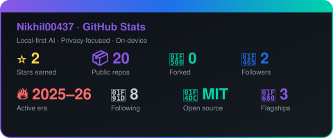
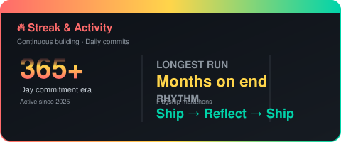
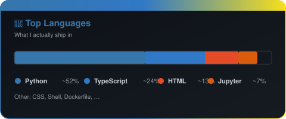
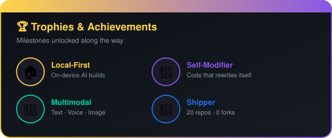

<div align="center">


<br/>


<br/>

<a href="https://github.com/Nikhil00437"></a>
<a href="https://slime-ai-rho.vercel.app/"></a>


</div>

---

## 🧠 Who I Am

<div align="center">


I'm **Nikhil**, an independent builder obsessed with **autonomous, privacy-first AI systems** that run entirely on-device.

I design tools that *think, remember, and improve themselves* — from a desktop assistant that proposes and rolls back its own code changes, to a creative image editor with on-device Stable Diffusion, to a React-based agent workspace that orchestrates local LLMs.

> *"If the cloud goes down, my tools should still work."*

</div>

<br clear="right"/>

### ⚡ Quick Facts

| 📊 Metric | 🚀 Mission | 🛠️ Default Stack |
|:---:|:---|:---|
| **20** public repos (0 forks) | Local-first, on-device AI | **Python**, **TypeScript** |
| **2** followers · **8** following | Privacy over convenience | **React**, **PyQt5** |
| **Active 2025 → 2026** | Self-modifying systems | **FastAPI**, **Vite** |
| **Open source** (MIT/Apache) | Multimodal by default | **LM Studio**, **Ollama** |

---

## 🎯 What I Build

```text
┌─────────────────────────────────────────────────────────────────────┐
│  🤖  Autonomous AI Agents       🧠  Layered memory & personalities   │
│  🖥️  Desktop AI Companions      🎨  Multimodal (text + voice + image)│
│  🔄  Self-Modifying Systems     🎮  Gamified tool leveling           │
│  🕷️  Local web automation       🧩  File-system "Vaults"             │
└─────────────────────────────────────────────────────────────────────┘
```

- 🏠 **On-device execution** — LM Studio, Ollama, faster-whisper, diffusers
- 🛡️ **Privacy-first** — no unnecessary cloud calls, user owns the data
- 🎨 **Rich UX** — themes, shortcuts, undo systems, quick-action panels
- 🧬 **Self-improving** — agents that observe, propose, and refine their own behavior

---

## 📊 GitHub Dashboard

<div align="center">


&nbsp;&nbsp;


<br/><br/>



</div>

---

## 🏆 Trophies

<div align="center">

</div>

---

## 🛠️ Tech I Reach For

<div align="center">

### 🧠 AI / ML & Local Inference


<br/><br/>

### 🎨 Frontend & UI


<br/><br/>

### 🖥️ Desktop & Backend


<br/><br/>

### 🗄️ Data & Infra


</div>

---

## 🚀 Flagship Projects

<div align="center">

<table>
<tr>
<td width="50%" valign="top">

### 🟣 [slime-ai](https://github.com/Nikhil00437/slime-ai)
**Local-first AI agent orchestration workspace** — my most ambitious build.

[](https://slime-ai-rho.vercel.app/)
[]()
[]()
[]()
[]()
[]()

A React + Vite workspace that combines a **local file-system "Vault"**, **layered cognitive memory**, a **Personality Forge**, and **gamified tool leveling** with a Python FastAPI scraper backend on port `11235`.

- 🧠 Multi-provider LLM support — Ollama, LM Studio, OpenAI, Anthropic, Gemini, Grok
- 💾 File System Access API + IndexedDB fallback
- 🕹️ Tools earn XP and rank up: **Basic → Legendary**
- 🕷️ Playwright + Crawl4AI browser automation
- 🔁 Autonomous agent loops with iteration & cost controls

</td>
<td width="50%" valign="top">

### 🔵 [ARIA](https://github.com/Nikhil00437/ARIA)
**Self-modifying Windows desktop AI assistant** — privacy-first, on-device.

[]()
[]()
[]()
[]()
[]()

A **PyQt5 desktop companion** that *observes its own behavior, proposes code changes, gets approval, and supports rollback*. Powered by a local Qwen model via LM Studio on port `1234`.

- 🔄 **Self-modification system** with rollback safety net
- 🎙️ Voice I/O: `faster-whisper` STT + `pyttsx3` TTS
- 🎨 Stable Diffusion 2.1 image generation
- 📊 Live system health monitoring (CPU/RAM/disk)
- 🧰 60+ Fabric patterns + 70+ local patterns
- 🎯 Intent modes: chat, command, web, wiki, music, PowerShell, image_gen

</td>
</tr>
<tr>
<td colspan="2" valign="top">

### 🟢 [PIXEDIT-image-editor](https://github.com/Nikhil00437/PIXEDIT-image-editor)
**A polished desktop image editor with built-in AI generation.**

[]()
[]()
[]()
[]()
[]()
[]()
[]()

A feature-rich image editor that doubles as a creative playground — load, edit, transform, *and* generate new images from text prompts without leaving the app.

- ✂️ Rotate/flip, filters, brightness/contrast, freehand + grid crop
- ↩️ **20-level undo/redo** with live preview
- ✏️ Text overlay & extensive keyboard shortcuts
- 🎨 **On-device Stable Diffusion** text-to-image
- 🎭 5 themes, auto-save, and a smooth editing flow

</td>
</tr>
</table>

</div>

---

## 📚 Other Notable Work

<div align="center">

| Repository | What it is | Stack | Updated |
|:---|:---|:---|:---:|
| [PROFILE](https://github.com/Nikhil00437/PROFILE) | This portfolio site | HTML | Apr 2026 |
| [web-dev-project-1](https://github.com/Nikhil00437/web-dev-project-1) | Web dev practice | HTML | Apr 2026 |
| [authcrudpractice](https://github.com/Nikhil00437/authcrudpractice) | Auth + CRUD practice | HTML | Feb 2026 |
| [screenshot-web-with-url-](https://github.com/Nikhil00437/screenshot-web-with-url-) | Web screenshot utility | Python | Feb 2026 |
| [cap](https://github.com/Nikhil00437/cap) | Capture / computer vision experiments | Python | Feb 2026 |
| [shiny-winner](https://github.com/Nikhil00437/shiny-winner) | Data analysis project | Jupyter | Jan 2026 |
| [emotional-analysis](https://github.com/Nikhil00437/emotional-analysis) | Sentiment / emotion analysis | — | Jan 2026 |
| [discordquestcompletionmodified](https://github.com/Nikhil00437/discordquestcompletionmodified) | Modified Discord quest script | — | Jan 2026 |
| [anomaly-detection-smsvuandt-](https://github.com/Nikhil00437/anomaly-detection-smsvuandt-) | Anomaly detection ML | Python | Jan 2026 |
| [side-project-1](https://github.com/Nikhil00437/side-project-1) | Side project | Python | Dec 2025 |
| [r](https://github.com/Nikhil00437/r) | Experiments / scratch space | Python | Sep 2025 |
| [movie_recommendation_small](https://github.com/Nikhil00437/movie_recommendation_small) | Classic ML recommender | Python | Aug 2025 |
| [slime](https://github.com/Nikhil00437/slime) | Placeholder (Apache 2.0) | — | Apr 2026 |

<sub>Plus ~4 smaller learning repos. Most predate the local-AI era — they document the journey, not the destination.</sub>

</div>

---

## 🐍 Contribution Graph

<div align="center">

</div>

<br/>

<p align="center">
  
</p>


---

## 🔭 Currently Exploring

```diff
+ 🧠 Agent orchestration patterns (LangChain / LlamaIndex style)
+ 🔗 Cross-pollinating slime-ai ⇄ ARIA — same memory, different shells
+ 🪟 Making desktop tools cross-platform (Windows → macOS / Linux)
+ 🖼️ More creative on-device generative tools
+ 🧪 CI/CD, testing, and packaging for Python desktop apps
- ⛔ Cloud-dependent "AI" wrappers — no thanks
```

---

## 📫 Connect

<div align="center">

<a href="https://github.com/Nikhil00437"></a>
<a href="https://nikhil00437.github.io/slime-ai/"></a>


<br/><br/>


</div>

---


<div align="center">
<sub>⭐ If any of my work resonates, a star goes a long way.</sub>
</div>
